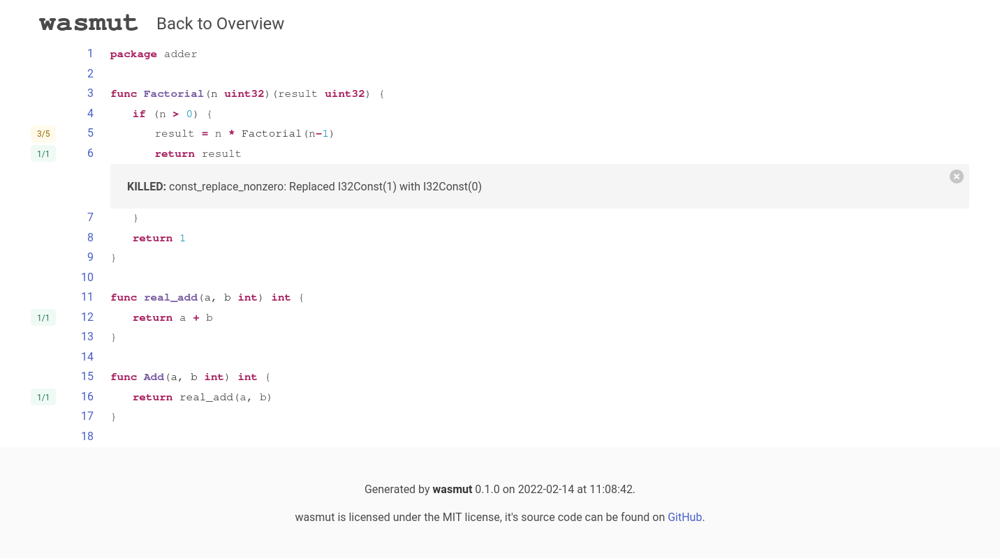

# wasmut
[](https://opensource.org/licenses/MIT)
[](https://github.com/lwagner94/wasmut/actions/workflows/ci.yml)
[](https://coveralls.io/github/lwagner94/wasmut?branch=main)

`wasmut` is a mutation testing tool for WebAssembly [WASI](https://wasi.dev/) modules.

## Table of Content
  - [Installation](#installation)
  - [Quick Start](#quick-start)
  - [Command Line Interface](#command-line-interface)
  - [WebAssembly Module Requirements](#webassembly-module-requirements)
  - [Configuration File Reference](#command-line-interface)
  - [Mutation Operators](#supported-mutation-operators)
  - [Author](#authors)
  - [License](#license)

## Installation
Currently, `wasmut` officially supports Linux and Windows. macOS should also 
mostly work, however I cannot guarantee anything, since I do not have access to a Mac.
### Pre-built binaries
For Linux and Windows, pre-built binaries for the `amd64` architecture can be found on
the [releases pages](https://github.com/lwagner94/wasmut/releases) of this repository.

### Installation using Cargo
`wasmut` is implemented in Rust, thus you need the Rust toolchain to compile the
project. The *minimum supported Rust version (MSRV)* is 1.58.

To install `wasmut` the latest development version of `wasmut`, clone
the git repository and use the `cargo install` command.
```sh
> # The --recursive flag is only needed if you want to run the unit tests.
> git clone --recursive https://github.com/lwagner94/wasmut
> cd wasmut
> cargo install --path .
```
This will install `wasmut` to `$HOME/.cargo/bin` by default. Make sure that 
this path is included in our `$PATH` variable.

## Development
If you want to hack on `wasmut`, simply check out the repository. Be sure to include
the `testdata` submodule.

```sh
> git clone --recursive https://github.com/lwagner94/wasmut
```

Once the repository is cloned, you can run the test-suite using the
`test` command.
```sh
cargo test
```

You may want to run `wasmut` as a release build. In development builds, 
running mutants takes a a lot more time.
```sh
cargo run --release -- mutate testdata/simple_go/test.wasm -C
```

You can use the `coverage.sh` script to generate 
a test-coverage report. Make sure that [grcov](https://github.com/mozilla/grcov) and the nightly version of the Rust compiler are installed.
```sh
./coverage.sh
```


## Quick start
Once installed, you can start using `wasmut`. To start off, you can 
try out some of the examples in the `testdata` folder. 
If you want to use `wasmut` with any of your own modules, 
please be sure to check out the [WebAssembly Module Requirements](#webassembly-module-requirements) chapter.

If you run the `mutate` command without any flags, `wasmut`
will try to load a file called `wasmut.toml` in the current 
directory and will fall back to default options if it cannot find it.
```sh
> # Run wasmut using default options (no filtering, all operators)
> wasmut mutate testdata/simple_add/test.wasm
[INFO ] No configuration file found or specified, using default config
[INFO ] Using 8 workers
[INFO ] Generated 37 mutations
...
```

Using the `-C/-c` flags, you can instruct wasmut to load 
a configuration file from a different path. The `-C` flag will try
to load `wasmut.toml` from the same directory as the module, while `-c` allows you to provide the full path to the configuration file.

```sh
> wasmut mutate testdata/simple_add/test.wasm -C
[INFO ] Loading configuration file from module directory: "testdata/simple_add/wasmut.toml"
[INFO ] Using 8 workers
[INFO ] Generated 1 mutations
[INFO ] Original module executed in 40 cycles
[INFO ] Setting timeout to 80 cycles
/home/lukas/Repos/wasmut/testdata/simple_add/simple_add.c:3:14: 
KILLED: binop_add_to_sub: Replaced I32Add with I32Sub
    return a + b;
              ^

ALIVE           0
TIMEOUT         0
ERROR           0
KILLED          1
Mutation score  100%

```

By default, `wasmut` will print the results to the console - as shown above.
If you add the `--report html` option, `wasmut` will 
create a HTML report in the `wasmut-report` folder.

```sh
> wasmut mutate testdata/simple_go/test.wasm -C --report html
[INFO ] Loading configuration file from module directory: "testdata/simple_go/wasmut.toml"
[INFO ] Using 8 workers
...
```




## Command Line Interface
### `help` 
Display the help menu
### `list-files`
```
List all files of the binary.

If a config is provided, this command will also show whether the file is allowed to be mutated. By
default, wasmut will try to load a wasmut.toml file from the current directory

USAGE:
    wasmut list-files [OPTIONS] <WASMFILE>

ARGS:
    <WASMFILE>
            Path to the wasm module

OPTIONS:
    -c, --config <CONFIG>
            Load wasmut.toml configuration file from the provided path

    -C, --config-samedir
            Attempt to load wasmut.toml from the same directory as the wasm module

    -h, --help
            Print help information

    -V, --version
            Print version information

```
### `list-functions`
```
List all functions of the binary.

If a config is provided, this command will also show whether the function is allowed to be mutated.
By default, wasmut will try to load a wasmut.toml file from the current directory

USAGE:
    wasmut list-functions [OPTIONS] <WASMFILE>

ARGS:
    <WASMFILE>
            Path to the wasm module

OPTIONS:
    -c, --config <CONFIG>
            Load wasmut.toml configuration file from the provided path

    -C, --config-samedir
            Attempt to load wasmut.toml from the same directory as the wasm module

    -h, --help
            Print help information

    -V, --version
            Print version information

```

### `list-operators`
```
List all available mutation operators.

If a config is provided, this command will also show whether the operator is enabled or not. By
default, wasmut will try to load a wasmut.toml file from the current directory

USAGE:
    wasmut list-operators [OPTIONS] [WASMFILE]

ARGS:
    <WASMFILE>
            Path to the wasm module

OPTIONS:
    -c, --config <CONFIG>
            Load wasmut.toml configuration file from the provided path

    -C, --config-samedir
            Attempt to load wasmut.toml from the same directory as the wasm module

    -h, --help
            Print help information

    -V, --version
            Print version information

```
### `mutate`
```
Generate and run mutants.

Given a (possibly default) configuration, wasmut will attempt to discover mutants and subsequently
execute them. After that, a report will be generated

USAGE:
    wasmut mutate [OPTIONS] <WASMFILE>

ARGS:
    <WASMFILE>
            Path to the wasm module

OPTIONS:
    -c, --config <CONFIG>
            Load wasmut.toml configuration file from the provided path

    -C, --config-samedir
            Attempt to load wasmut.toml from the same directory as the wasm module

    -h, --help
            Print help information

    -o, --output <OUTPUT>
            Output directory for reports
            
            [default: wasmut-report]

    -r, --report <REPORT>
            Report output format
            
            [default: console]
            [possible values: console, html]

    -t, --threads <THREADS>
            Number of threads to use when executing mutants

    -V, --version
            Print version information

```

### `new-config`
```
Create new configuration file

USAGE:
    wasmut new-config [PATH]

ARGS:
    <PATH>    Path to the new configuration file

OPTIONS:
    -h, --help       Print help information
    -V, --version    Print version information
```

### `run`
```
Run module without any mutations

USAGE:
    wasmut run [OPTIONS] <WASMFILE>

ARGS:
    <WASMFILE>    Path to the wasm module

OPTIONS:
    -c, --config <CONFIG>    Load wasmut.toml configuration file from the provided path
    -C, --config-samedir     Attempt to load wasmut.toml from the same directory as the wasm module
    -h, --help               Print help information
    -V, --version            Print version information
```


## WebAssembly module requirements

`wasmut` currently supports WebAssembly modules using the [WebAssembly System Interface (WASI)](https://wasi.dev/).
`wasmut` will execute the `_start` function as an entry point into the module and will use the 
module's exit code (set by the return value of `main` or explicit calls to `exit`) to determine the outcome 
of the module's tests - 0 indicating success, and any non-zero exit code as a failure.

`wasmut` makes heavy use of DWARF debug information for mutant filtering and report
generation. Make sure to compile the WebAssembly module using the correct compiler flags
to ensure that debug information is embedded into the module.

Furthermore, compiler optimizations have a strong influence on `wasmut`'s 
performance. Some more experiments have to be done to give any recommendations,
but for now simply refer to the examples in the `testdata` directory
for any hints on what compiler options to use.


## Configuration options

### `[engine]` section
  - `timeout_multiplier`: 
    Before executing mutants, wasmut will run the wasm module without 
    any mutations and measure the number of cycles it takes to execute.
    Mutants then are allowed to execute with a timeout of 
    `timeout = original_cycles * timeout_multiplier`

    ```toml
    timeout_multiplier = 2.0
    ```

  - `map_dirs`: Map directories into the WebAssembly runtime. By default, modules cannot access the host's filesystem. If your module needs to access any files, 
  you can use the `map_dirs` option to define path mappings.
    ```toml
    # Map testdata/count_words/files to /files
    map_dirs = [["testdata/count_words/files", "files"],]
    ```

  - `coverage_based_execution`: 
    Before executing mutants, wasmut will run the wasm module without 
    any mutations and generate coverage information. 
    If `coverage_based_execution` is enabled, the execution of mutants
    where the mutated instruction was never executed will be skipped.
    Defaults to `true`.

    ```toml
    coverage_based_execution = false
    ```


### `[filter]` section


  - `allowed_function/allowed_file`: By default, all files and functions are allowed, which means that every WebAssembly instruction can potentially be mutated. This is not very practical, so it possible to specify and allowlist for functions and/or files.
  In allowed_functions and allowed_files, you can specify a list of regular expressions that are used to match the function and file names. A wasm-instruction is allowed to be mutated if its function or file matches at least one of the corresponding regular expressions. An empty regular expression also matches everything.
  Use the `wasmut list-files` or `wasmut list-functions` commands to get a list of all functions and files in the wasm module.

    ```toml
    allowed_functions = ["^add"]
    allowed_files = ["src/add.c", "src/main.c"]
    ```

### `[operators]` section
  - `enabled_operators`: By default, all operators are allowed. If this is not what you want, 
  you can use the enabled_operators option to specify which operators 
  should be enabled. The option is a list of regular expressions. 
  Use the `wasmut list-operators` command or consult the [documentation](./operators.md) to get a list of all operators.

    ```toml
    # Enable binop_sub_to_add and all relop_* operators
    enabled_operators = ["binop_sub_to_add", "relop"]
    ``` 


### `[report]` section
  - `path_rewrite`: When rendering reports, `wasmut` needs to have access to the original source files.
  `wasmut` uses DWARF debug information embedded in the WebAssembly modules to locate them. As DWARF embeds absolute paths for the source files into the module, 
  it can be problematic if you want to want to create reports for WebAssembly modules that where build on another host.
  The `path_rewrite` option allows to specify a regular expression and a replacement that will be applied to any source file path before creating the report.
  Internally, Rust's `Regex::replace` is used. Consult the [documentation](https://docs.rs/regex/latest/regex/struct.Regex.html#method.replace) for any advanced replacement scenarios.
  
    ```toml
    # Replace /home/user/wasmut/ with "build"
    # e.g. /home/user/test/main.c -> 
    #      build/test/main.c
    path_rewrite = ["^/home/user/", "build"]
    ```

### Full example
```toml
[engine]
timeout_multiplier = 4.0
map_dirs = [["testdata/count_words/files", "files"],]
coverage_based_execution = true

[filter]
allowed_functions = ["^count_words"]
#allowed_files = [""]

[operators]
enabled_operators = ["binop_sub_to_add", "relop"]

[report]
path_rewrite = ["^.*/wasmut/", ""]
```


## Supported Mutation operators

The mutation operators available in `wasmut` are for now mainly based on [mull's operators](https://mull.readthedocs.io/en/latest/SupportedMutations.html)

| Name                        | Description                                                                  |
| ---                         | ---                                                                          |
| `binop_sub_to_add`          | Replace subtraction with addition                                            |
| `binop_add_to_sub`          | Replace addition with subtraction                                            |
| `binop_mul_to_div`          | Replace multiplication with signed/unsigned division                         |
| `binop_div_to_mul`          | Replace signed/unsigned division by multiplication                           |
| `binop_shl_to_shr`          | Replace bitwise left-shift with signed/unsigned right-shift                  |
| `binop_shr_to_shl`          | Replace signed/unsigned right-shift with left-shift                          |
| `binop_rem_to_div`          | Replace remainder with  division of the same signedness                      |
| `binop_div_to_rem`          | Replace division with remainder of the same signedness                       |
| `binop_and_to_or`           | Replace and with or                                                          |
| `binop_or_to_and`           | Replace or with and                                                          |
| `binop_xor_to_or`           | Replace xor with or                                                          | 
| `binop_or_to_xor`           | Replace or with xor                                                          |
| `binop_rotl_to_rotr`        | Replace bitwise left-rotation with right-rotation                            |
| `binop_rotr_to_rotl`        | Replace bitwise right-rotation with left-rotation                            |
| `unop_neg_to_nop`           | Replace unary negation with nop                                              |
| `relop_eq_to_ne`            | Replace equality test with not-equal                                         |
| `relop_ne_to_eq`            | Replace not-equal test with equality                                         |
| `relop_le_to_gt`            | Replace less-equal with greater-than of the same signedness                  |
| `relop_le_to_lt`            | Replace less-equal with less-than of the same signedness                     | 
| `relop_lt_to_ge`            | Replace less-than with greater-equal of the same signedness                  |
| `relop_lt_to_le`            | Replace less-than with less-equal of the same signedness                     |
| `relop_ge_to_gt`            | Replace greater-equal with greater-than of the same signedness               |
| `relop_ge_to_lt`            | Replace greater-than with less-than of the same signedness                   |
| `relop_gt_to_ge`            | Replace greater-than with greater-equal of the same signedness               |
| `relop_gt_to_le`            | Replace greater-than with less-equal of the same signedness                  |
| `const_replace_zero`        | Replace zero constants with 42                                               |
| `const_replace_nonzero`     | Replace non-zero constants with 0                                            |
| `call_remove_void_call`     | Remove calls to functions that do not have a return value                    |
| `call_remove_scalar_call`   | Remove calls to functions that return a single scalar with the value of 42   |


## Authors
`wasmut` was developed by Lukas Wagner.

## License
Copyright © 2021-2022 Lukas Wagner.

All code is licensed under the MIT license. See [LICENSE.txt](LICENSE.txt) file for more information.
